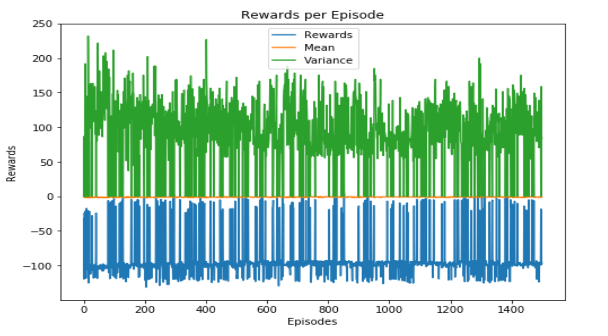
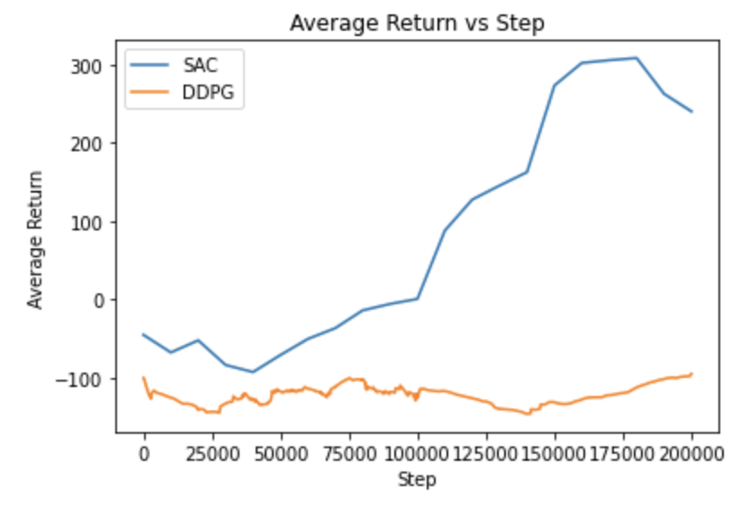
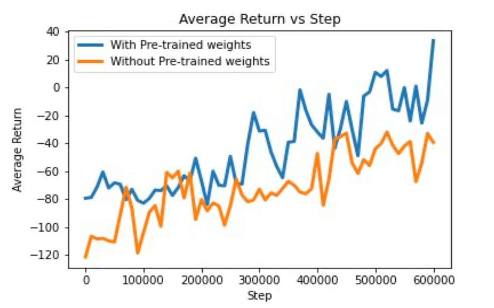

# Application-of-Model-Free-Off-policy-Methods-in-Continuous-Action-Domains

## Authors: Srikanth Babu Mandru, Prabal Malviya

### Project Goals:

Continuous action domains are the domains with continuous action spaces, that is the space where the agent must output some real-valued number, possibly in multiple dimensions.

The study of these domains is particularly important in Reinforcement Learning (RL) because a lot of real-world problems can be formulated through these. Some of the well-known domains which can be treated as continuous action domains are :

1. Self Driving Cars: Here based on the lidar sensors, we need to provide inputs like acceleration, braking power, etc. Which are all continuous in nature.

2. Robotics: A robot can have freedom of motion in multiple dimensions and for the robot to have a smooth motion, the nature of the action should be continuous in nature.

3. Finance: Many financial applications like portfolio optimization, optimal trading use reinforcement learning in a continuous action space.

Recent advancements in these domains motivated us to study algorithms that could be used to solve this type of problems. In this project, we choose the Bipedal walker as our sample problem environment. Apart from that, we also wanted to see if the bootstrapping (transfer-learning) approach works for Reinforcement Learning algorithms in continuous action domains. That is can we reduce the learning time for an algorithm to obtain the best policy given it has already learned the best policy in a similar domain.

### Approaches and methods:

For solving this continuous action task (Bipedal Walker), we have initially worked with the Deep Q-Network (DQN) method and later shifted our focus towards the policy-gradient methods like Deep Deterministic Policy Gradients (DDPG) and Soft Actor-Critic (SAC). All of the above mentioned methods are derived from Deep Reinforcement learning techniques.

### Results:

**1. DQN on BipedalWalker Environment:**

The first algorithm that we applied to the BipedalWalker environment was Deep Q-Network (DQN). Below are the graphs for the reward gathered per episode (agent's steps until it reaches a goal state) and the variance in each episode. 

 

 Figure 1: Reward gathered per episode by the DQN agent on Bipedal-Walker Environment 

While DQN solves problems with high-dimensional observation spaces, it can only handle discrete and low-dimensional action spaces. This is so because it is not straightforward to find the argmax of action over a continuous function. An obvious next choice would be discretization of action space, but this quickly leads to exploding action space which cannot be handled efficiently by DQN. This can be verified from the figure 1. The reward gathered in each episode is fluctuating a lot and even after 1400 episodes, the agent is not able to learn anything. So, DQN is obviously not a good choice for continuous action domains.

**2. DDPG and SAC on BipedalWalker Environment:**

The performance of the agent was measured through the average return obtained from the environment while training. We have plotted the curves showing the variations of the average return over the training steps for both the methods ( DDPG and SAC). Initially, we experimented using both the reinforcement learning algorithms on the plain terrain (without obstacles) to get a better understanding of various methods and their efficiency in handling this task. On the plain-terrain, we obtained the average returns (for both methods) as shown in the below figure:

 Figure 2: Comparison between the DDPG and SAC on soft-terrain Bipedal Walker Environment 

It can be observed from the above figure 2 that DDPG is learning very slowly compared to the SAC which has reached a higher average return in relatively lesser time, depicting the faster learning of the SAC algorithm. Since the SAC method uses the “Reparameterization Trick'' as mentioned in the ‘Methods’ section, SAC resulted in a smoother learning curve with fewer oscillations compared to that of DDPG. It also proves the stability of the SAC method which is related to the fact that it uses the “Clipped Double-Q Trick”. From the above plot, we have achieved the best average return of around 300 using the SAC in about 200,000 steps.

During the experimentation, we have also found that DDPG is highly sensitive to the hyperparameters and it takes a lot of time and trials to tune them. From the above experimentation, we can observe that the Soft Actor-Critic (SAC) method is performing better than DDPG on this particular task . Thus, we preferred working only with the SAC on our next part of the project which is the hard-terrain Bipedal-Walker environment.

**3. Transfer learning experiment:**

Our next experiment was to see how bootstrapping(transfer-learning) helps learn the agent faster. We ran two models using the SAC algorithm. In the first model, we fed the pre-trained weights from the plain-terrain environment and bootstrapped the learning process. In the second model, we didn’t use any pre-trained weights rather let the agent learn everything on its own.

Similar to the soft-terrain, we have plotted the average return curves to evaluate the performance of both aforementioned SAC variations on the hard-terrain, and the plot is as shown in the figure 3. Here, from figure 3, we can infer that the average return in the case of a model with pre-trained weights shows better learning of the agent compared to the model trained from random weights. Our initial expectation was that there will be a slight difference in learning between the two cases. But, we are amused to see a significant boost in the agent’s ability to learn quicker with the transfer learning technique which we can see by the amount of variation of the results from both the methods. This experimentation of using the pre-trained weights proves that transfer-learning on similar domains reduces the training time and the computational cost to learn an optimal policy.

 Figure 3: Comparison of SAC with transfer learning and without transfer learning on the Hardcore Bipedal-Walker Environment 

With the learned policy from SAC on the soft-terrain, we have simulated some episodes of agent walking applied to the Bipedal walker environment [1]. To know the effectiveness of the learned policy, we have also simulated an agent using the random policy (chooses action randomly using initial policy function approximator) which is again included at the link [1]. From the videos, we can observe that the SAC agent is reaching the goal state in all three episodes which shows the robustness of the policy learnt. On the other hand, the random agent is struggling to even move forward by one-step or falling off to the ground quickly. From the simulated agent, we can understand the effectiveness of the SAC method on the Bipedal Walker.

Coming to the transfer-learning experimentation part, when we executed both the algorithms (with and without transfer-learning) on the walker, we obtained the walking behavior as shown in the simulated videos [1]. From the videos, it can be clearly seen that the agent with pre-trained weights has learned a better policy for the hardcore terrain, and is able to walk more steps towards the goal state.

**Overall Comment on results:**

To conclude, from the experimentation and analysis that we have performed, it can be inferred that DDPG is able to learn the policy on continuous action-spaces, but takes longer times to train the model, and sensitive to the hyperparameters. Whereas, the SAC optimizes the expected entropy besides the expected reward which makes the agent to explore more and learn the policy in comparatively less time. We have also performed the experimentation using the transfer-learning technique, and observed a significant improvement in the training speeds over the model trained from the random initialization on a hard-terrain walker environment.

### References:

[1] Our Bipedal Walker simulated videos link: walker_videos

[2] Deep Q-Learning Blog: https://www.analyticsvidhya.com/blog/2019/04/introduction-deep-q-learning-python/ 

[3] DDPG Keras Implementation: https://keras.io/examples/rl/ddpg_pendulum/ 

[4]Actor-Critic Keras Implementation: https://keras.io/examples/rl/actor_critic_cartpole/ 

[5] TensorFlow: https://www.tensorflow.org/

[6] Images in this presentation : Google Images

[7] Actor-Critic Method - https://www.tensorflow.org/tutorials/reinforcement_learning/actor_critic

[8] Deep Q-Network (DQN) - https://www.tensorflow.org/agents/tutorials/1_dqn_tutorial 

[9] REINFORCE - https://www.tensorflow.org/agents/tutorials/6_reinforce_tutorial

[10] DeepMind Lecture: https://youtu.be/bRfUxQs6xIM

[11] DQN from Keras: https://keras.io/examples/rl/deep_q_network_breakout/

[12] Q-learning: https://en.wikipedia.org/wiki/Q-learning

[13] Bi-Pedal Walker: https://towardsdatascience.com/teach-your-ai-how-to-walk-5ad55fce8bca 

[14] SAC (Soft Actor-Critic): https://arxiv.org/abs/1801.01290

[15] A. DDPG (Deep Deterministic Policy Gradient method) : https://arxiv.org/abs/1509.02971 

B. Open AI Blog: https://spinningup.openai.com/en/latest/algorithms/ddpg.html

[16] TD3 (Twin Delayed Deep Deterministic Policy Gradient Method): https://arxiv.org/abs/1802.09477

[17] OpenAI Gym Bipedal Walker: https://gym.openai.com/envs/BipedalWalker-v2/

